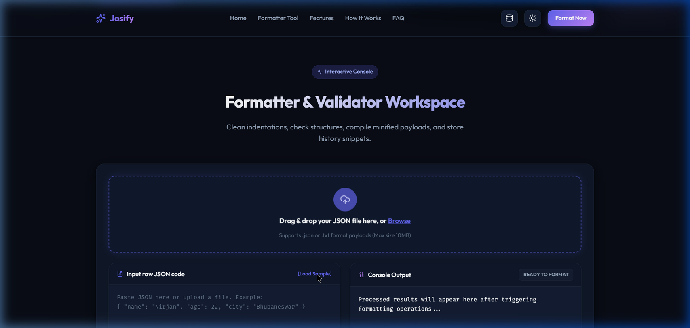

# ⚡ Josify - Premium JSON Formatter & Validator



Josify is a premium, full-stack developer workspace built on the MERN stack. Designed with beautiful glassmorphism aesthetic guidelines, it lets you format, validate, minify, and store your API JSON payloads seamlessly in a secure and modern environment.

---

## ✨ Features

- 🛠 **Drag & Drop File Uploads**: Simply drop any `.json` or `.txt` file directly onto the console to load and edit it instantly.
- 🎨 **Premium Modern UI**: Sleek, responsive layout built with glassmorphic cards, harmonized theme tokens, and dynamic micro-animations.
- 🌓 **Persistent Dark/Light Mode**: Toggle between premium custom-themed visual environments with smooth ease transitions and local storage remembrance.
- ✅ **RFC Schema Validation**: Instant linter validation checking JSON structure compliance, returning clean success badges or detailed inline syntax error reports.
- ⚡ **Ultra-Dense Minification**: Strips blank spaces and line breaks instantly to compress data payloads for efficient API request testing.
- 💾 **MERN Database persistence**: Give names to your clean snippets and save them directly to a persistent MongoDB database.
- 🕒 **Sliding Drawer Sidebar**: Slides in seamlessly from the right to quickly view, load, or delete previous snippets from your history collection.
- 📊 **Real-time Live Metrics**: Tracks and logs character counts, total lines, and exact file size in bytes dynamically as you type.
- 📋 **One-click Clipboard Copy**: Instantly copy console output blocks to your clipboard with clean alert notification popups.
- 🔗 **Clean 3-Column Footer**: Modern deep-slate footer grouping navigation, features, and platform legal items beautifully.

---

## 🚀 Tech Stack

### Frontend
- **React** (Vite Dev Server)
- **Lucide React** (Modern Vector Icon Library)
- **Axios** (Backend API Integrations)
- **Vanilla CSS3** (Curated custom-themed styles)

### Backend
- **Node.js**
- **Express.js** (REST API Controller Router)
- **Mongoose ODM** (MongoDB Schema Modeler)

### Database
- **MongoDB** (Cloud Atlas or Local Server Instance)

---

## 🛠️ Installation & Setup

### Prerequisites
- [Node.js](https://nodejs.org/) (v16+ recommended)
- [MongoDB](https://www.mongodb.com/) (Local server or Cloud Atlas cluster)

### 1. Clone the repository
```bash
git clone https://github.com/NirjanBarik/json-formatter-mern.git
cd json-formatter-mern
```

### 2. Install Project Dependencies
```bash
# Install root script orchestrators (concurrently)
npm install

# Install client packages
cd client && npm install

# Install server packages
cd ../server && npm install
```

### 3. Backend Environment Configuration
Create a `.env` file in the `/server` folder:
```env
PORT=5000
MONGODB_URI=your_mongodb_connection_string
```

### 4. Run Development Servers
From the **root directory** of the repository, execute:
```bash
npm run dev
```
This triggers both the backend node server (listening on port `5000`) and the Vite client dev server (running on `http://localhost:5173/`) concurrently.

---

## 🖥️ Workspace Console Guide

1. **Paste/Load JSON:** Paste raw text into the input workspace, click the `[Load Sample]` link to test standard structures, or drag a `.json` file from your desktop.
2. **Execute Operation:** Trigger **Format JSON**, **Validate Payload**, or **Minify Output** buttons instantly.
3. **Inspect Output:** View perfectly indented JSON strings or precise schema validation syntax error flags.
4. **Persist Logs:** Click **Save Snippet** to store the template in MongoDB. Reload previous entries at any time using the database history drawer in the navbar.

---

## 🌐 Production Deployment

### Backend (Render Web Service)
1. Register a new **Web Service** on [Render](https://render.com/).
2. Select your GitHub repository.
3. Configure the following build guidelines:
   - **Root Directory**: `server`
   - **Build Command**: `npm install`
   - **Start Command**: `npm start`
4. Add the following **Environment Variables**:
   - `MONGODB_URI`: Your MongoDB Atlas URI.

### Frontend (Vercel Host)
1. Add a new project on [Vercel](https://vercel.com/).
2. Connect your GitHub repository.
3. Configure the following project parameters:
   - **Framework Preset**: `Vite`
   - **Root Directory**: `client`
   - **Build Command**: `npm run build`
   - **Output Directory**: `dist`
4. Add the following **Environment Variable**:
   - `VITE_API_URL`: Your live Render API URL (e.g., `https://your-api.onrender.com/api`).

---

## 🤝 Contributing

Contributions are welcome! If you have suggestions or want to report bugs, feel free to open an issue or submit a pull request:

1. Fork this Project
2. Create your Feature Branch (`git checkout -b feature/AmazingFeature`)
3. Commit your Changes (`git commit -m 'Add some AmazingFeature'`)
4. Push to the Branch (`git push origin feature/AmazingFeature`)
5. Open a Pull Request

---

## 📜 License

Distributed under the MIT License. See `LICENSE` for more information.

---

## 📧 Contact

**Nirjan Barik** - nirjanbarik1@gmail.com

Project Link: [https://github.com/NirjanBarik/json-formatter-mern](https://github.com/NirjanBarik/json-formatter-mern)
